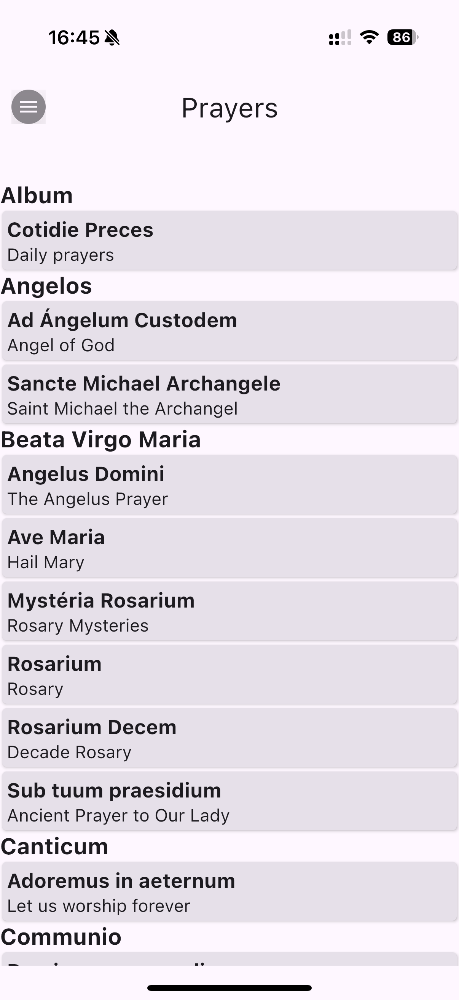
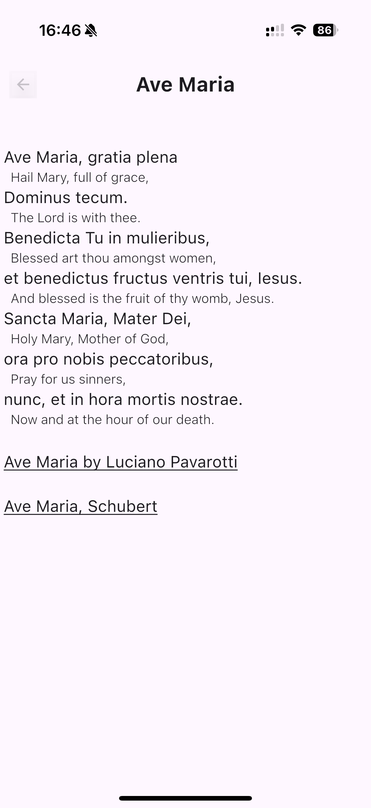

<h1 style="text-align: center;">Pray Latin</h1>

| --- | --- |
|  |  |
|  |  |

App for Android devices is in testing phase. You can start testing by joining [praylatin@googlegroups.com group](https://groups.google.com/g/praylatin) and visiting link above.

## About

__Pray Latin__ is an application helping with praying in Latin and learning Latin prayers.

It displays prayers in your own language inline to help understand the Latin text which in turn allows to quickly learn prayer in Latin.

__It contains large collection of prayers__ in Latin and other languages and it can be used as daily prayer book.

__This is an open source software__ available online on
[the project development site](https://just-4.dev/LatinPray). 

## License

Source code is available under __[AGPLv3 License](https://www.gnu.org/licenses/agpl-3.0.en.html)__.

## Contact

You can contact the author of the app by sending an email to address: [devel@praylatin.app](mailto:devel@praylatin.app) or 
you can submit request online on this project development website: [new Issue](https://just-4.dev/LatinPray/~issues/new)

Please do not hesitate to contact me if you have any problems using the app, suggestions for new features, improvements or correct mistakes.

## Translations

The app already has UI translation to a few languages. You can submit a new translation in your own language. To do so, please create a copy of
the [translation file](shared/src/commonMain/composeResources/values/strings.xml) in your language and submit as a [new issue](https://just-4.dev/LatinPray/~issues/new).
It will be added to the project after review.

## New prayers

If you have suggestions or ideas for new prayers to be added to the app, please send me an email or open a new issue as described above. 

However, the best way to have new prayers in the app is to submit them in ready to use format as `yaml` file. 
This reduces the amount of work for the developer and allows for quickly adding new content. 
If you are interested in contributing new prayers, please continue to read below to learn about the prayer file format.

## Other documents

1. [Prayer file format](docs/prayerfile.md)
2. [App settings description](docs/appsettings.md)